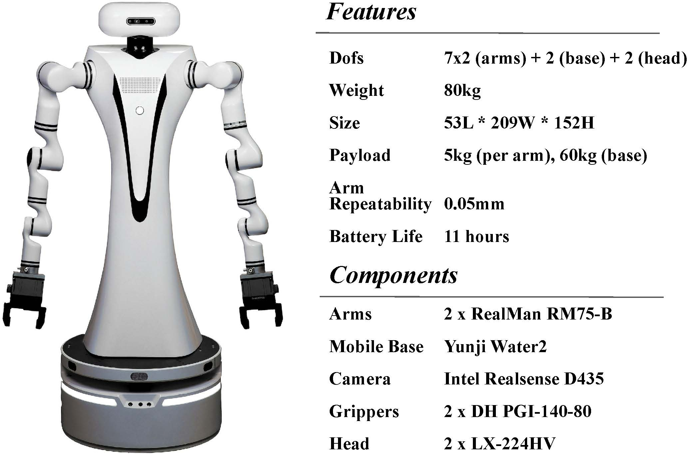
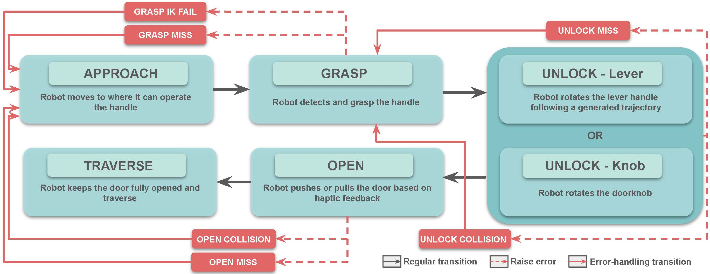
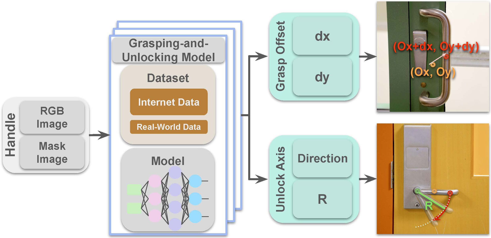
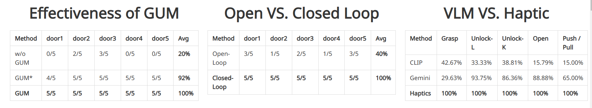
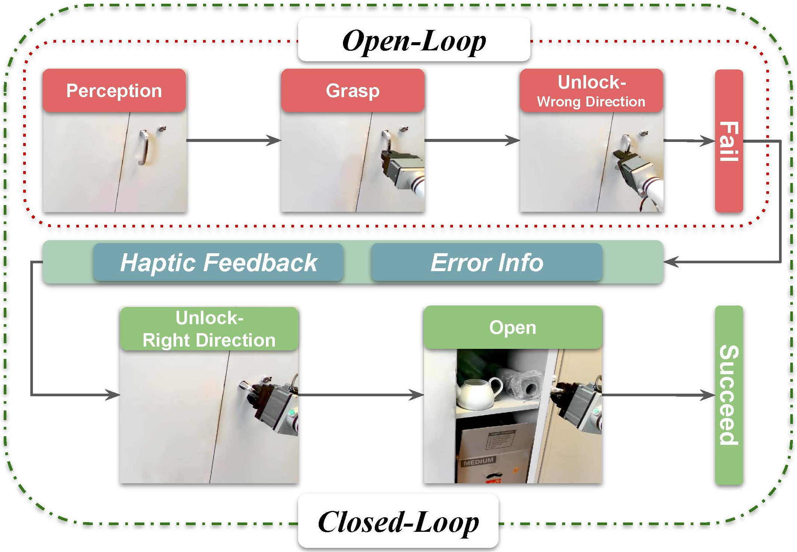

# [ICRA'25] DoorBot: Closed-Loop Task Planning and Manipulation for Door Opening in the Wild with Haptic Feedback
This is the official repository for the paper: 

DoorBot: Closed-Loop Task Planning and Manipulation for Door Opening in the Wild with Haptic Feedback

<a href="https://tx-leo.github.io/">Zhi Wang</a><sup>* 1,2</sup>, &nbsp;&nbsp;
<a href="https://scholar.google.com/citations?user=zzpPyQwAAAAJ&hl=en">Yuchen Mo</a><sup>* 1</sup>, &nbsp;&nbsp;
<a href="https://leumasnij.github.io//">Shengmiao Jin</a><sup>1</sup>, &nbsp;&nbsp;
<a href="https://siebelschool.illinois.edu/about/people/all-faculty/yuanwz">Wenzhen Yuan</a><sup>1</sup>, &nbsp;&nbsp;
<br>

<sup>1</sup>University of Illinois at Urbana-Champaign, <sup>2</sup>Tsinghua University

[[Website]](https://tx-leo.github.io/DoorBot), [[Arxiv]](https://arxiv.org/abs/2504.09358), [[Paper]](https://arxiv.org/pdf/2504.09358), [[Video]](https://youtu.be/_7GVSsXtLFg), [[UIUC Summary]](https://siebelschool.illinois.edu/news/doorbot), [[Dataset]](https://www.wolai.com/tx-leo/bUWZ27ZM9QdjWSpaEVEWpQ)


Proposed DoorBot, a haptic-aware closed-loop hierarchical control framework that enables robots to explore and open different unseen doors in the wild. We test our system on 20 unseen doors across different buildings, featuring diverse appearances and mechanical types. Our framework achieves a 90% success rate, demonstrating its ability to generalize and robustly handle varied door-opening tasks.

## 1. Hardware Setup
The hardware setup and issues log for the RealMan Mobile Bimanual Humanoid Robot can be found in [RealMan Hardware Doc](/docs/realman_hardware_doc.md)

You can check [RealMan Software Doc](/docs/realman_software_doc.md) to learn how to control different parts of the robot using python3 API code.


Visual appearance and configurations of our bimanual mobile robot.

## 2. Door Opening
### Server
`DTSAM` / `RANSAC` / `GUM` need to run on the server.
You can check [server.py](/open_door/server.py) and [cfg_server.yaml](/open_door/cfg/cfg_server.py) to setup the server.
Then get the code to the server:

```
conda create -n doorbot python=3.8
conda activate doorbot
cd /your/root/path/
git clone https://github.com/TX-Leo/DoorBot.git
```

You can check [dtsam_package](/open_door/dtsam_package), [ransac_package](/open_door/ransac_package), and [gum_package](/open_door/gum_package) to set up the dependencies.

## Local
### Get the code:
```
conda create -n doorbot python=3.8
conda activate doorbot
cd /your/root/path/
git clone https://github.com/TX-Leo/DoorBot.git
```

### Opening-door task:
```
cd open_door
```
For testing:
```
python main.py -n 0 -t lever
```
It will do the action step by step.

open_loop:
```
python open_loop.py -n 0 -t lever
```

close-loop:
```
python close_loop_SM_GUM.py -n 0 -t lever
```

## 3. Primitives Design
We design six motion primitives based on the key steps of opening doors and implement them through low-level controllers. This reduces the dimensionality of the action space and avoids reliance on extensive human expert data.


System Architecture of DoorBot.

Our High-Level Planner.

The high-level planner (state machine) and the low-level controllers (6 primitives) are implemented in the [primitive.py](/open_door/primitive.py) file.

You can check out [prompt.py](/open_door/prompt.py) for the textual input for VLM including high-level and low-level.

## 4. Grasping-and-Unlocking Model (GUM)

GUM refines the model-based grasp pose prior for the grasp primitive, and simultaneously predicts the motion trajectory for unlocking. It takes RGB and mask images of the handle as input and outputs the adjusted grasp offset (dx, dy) and the unlock axis direction (R). The model is trained on a combination of internet data and real-world data. This allows it to generalize effectively to unseen scenarios.

### Dataset
We create a dataset of 1,303 images featuring various door handles, collected from the Internet and real-world photos. The dataset includes four common handle types: lever handles, doorknobs, crossbars, and cabinet handles. Based on object masks generated by Detic and SAM, we manually label the appropriate grasp point and rotation parameters on the images.

- GUM Dataset (Original): 1303
  - Internet: 766
  - Real-World: 537
      - xxx.HEIC: rgb image
      - xxx.jpg: rgb image
      - xxx_mask.png: handle mask image
      - xxx.json: bounding box info of handle (w,h,box,Cx,Cy,orientation); Grasp Offset (dx,dy); Unlock Axis (R)
      - xxx.txt: box[0],box[1],box[2],box[3],dx,dy,R
      - xxx_annotated.png: handle annotated image

Original dataset (before augmentation) can be found in [here (todo ...)](/docs/realman_software_doc.md).
You can run [handle_data_augmentation.py](/open_door/gum_package/handle_data_augmentation.py) for data augmentation.


### Training
```
cd gum_package
python train.py
```
You can check checkpoints in [checkpoints (todo ...)]().

## 5. Closed System with Haptic Feedback

Haptic feedback in 3 motion primitives. For unlock-lever and unlock-knob, the current threshold for the elbow joint tells the robot when to stop. For open the increase/decrease of current feedback on the elbow joint shows the push-/pull-type of the door.

The haptic feedback is implemented in the [primitive.py](/open_door/primitive.py) and [arm.py](/open_door/arm.py).


## 6. Main Result


Our method consistently outperforms other combinations, showing an average success rate improvement from 50% to 90% across all manipulation tasks. None of the doors nor the handles are seen in the training set, proving our model’s generalizability across different situations.

## 6. Other Results



Examples of how GUM fixes bad grasp pose during our field test.


With multi-modal feedback, our system can open the cabinet with an unknown unlocking direction via explore-and-adapt.


<!-- ## 3. system architecture


 -->

## 7.Bibtex
If you find our work helpful, please leave us a star and cite our paper. Thank you!

@article{wang2025doorbot,
  title={DoorBot: Closed-Loop Task Planning and Manipulation for Door Opening in the Wild with Haptic Feedback},
  author={Wang, Zhi and Mo, Yuchen and Jin, Shengmiao and Yuan, Wenzhen},
  journal={arXiv preprint arXiv:2504.09358},
  year={2025}
}
